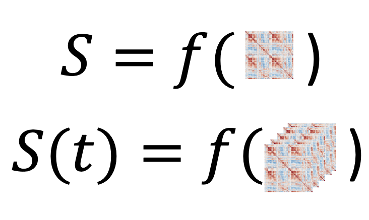
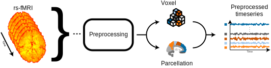
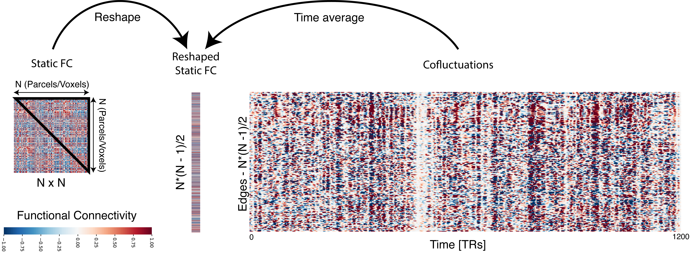
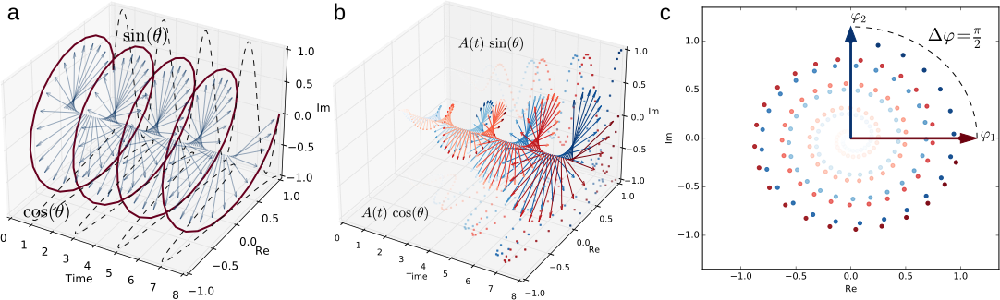
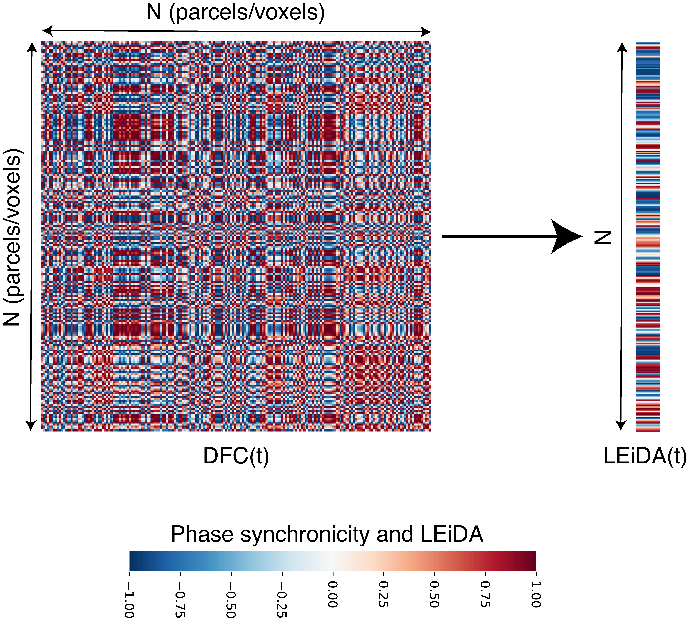
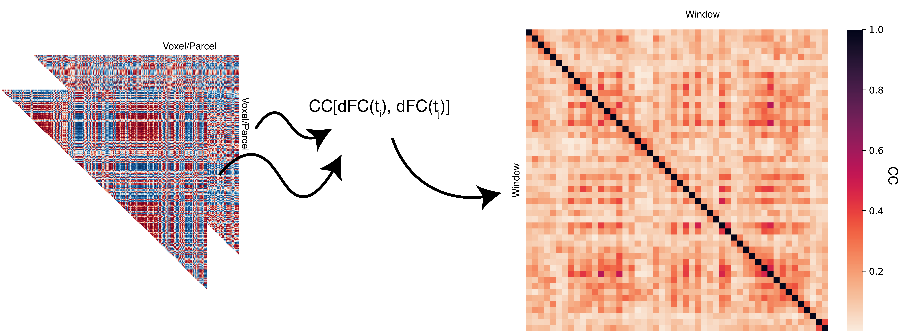

<!-- 
!!!! IMPORTANT: run `source("utils/render.R")` to publish instead of clicking on 'Knit'
-->

```{r setup, warning=FALSE, message=TRUE, include=FALSE}
source("utils/config.R")  

fast <- FALSE  # Make this false to skip the chunks
```


# Introduction

```{r badges, echo=FALSE, message=TRUE, warning=FALSE, results='asis'}
# This chunk is a bit complex so don't worry about it: it's made to add badges to the HTML versions
# NOTE: You have to replace the links accordingly to have working "buttons" on the HTML versions
if (!knitr::is_latex_output() && knitr::is_html_output()) {
  cat("
      [](https://creativecommons.org/licenses/by-sa/4.0/)
      [](https://github.com/CoDe-Neuro/dfc_chapter)
      [](https://code-neuro.github.io/dfc_chapter/)
      [](https://github.com/CoDe-Neuro/dfc_chapter/raw/main/word_and_pdf/SupplementaryMaterials.docx)
      [](https://github.com/CoDe-Neuro/TemplateResults/blob/main/word_and_pdf/SupplementaryMaterials.pdf)")
}
```

This document was prepared on `r format(Sys.Date())`.

# Fig 1

```{r fig1, echo=FALSE, out.width = "50%", message=TRUE, warning=FALSE}
# Let's include a demo GIF (this doesn't work in PDF documents)
if (!knitr::is_latex_output()) {
  
}
```

# Fig 2

```{r fig2, echo=FALSE, message=TRUE, warning=FALSE}
# Let's include a demo GIF (this doesn't work in PDF documents)
if (!knitr::is_latex_output()) {
  
}
```

Adapted from: https://en.wikipedia.org/wiki/Voxel#/media/File:Voxels.svg

# Fig 3

```{r fig3, echo=FALSE, message=TRUE, warning=FALSE}
# Let's include a demo GIF (this doesn't work in PDF documents)
if (!knitr::is_latex_output()) {
  knitr::include_graphics("figures/fig3.png")
}
```

# Fig 4

```{r fig4, echo=FALSE, message=TRUE, warning=FALSE}
# Let's include a demo GIF (this doesn't work in PDF documents)
if (!knitr::is_latex_output()) {
  
}
```

# Fig 5

```{r fig5, echo=FALSE, message=TRUE, warning=FALSE}
# Let's include a demo GIF (this doesn't work in PDF documents)
if (!knitr::is_latex_output()) {
  
}
```

# Fig 6

```{r fig6, echo=FALSE, message=TRUE, warning=FALSE}
# Let's include a demo GIF (this doesn't work in PDF documents)
if (!knitr::is_latex_output()) {
  
}
```

# Fig 7

```{r fig7, echo=FALSE, message=TRUE, warning=FALSE}
# Let's include a demo GIF (this doesn't work in PDF documents)
if (!knitr::is_latex_output()) {
  
}
```

```{r child=if (fast == FALSE) 'slide.Rmd'}
```

```{r child=if (fast == FALSE) 'cofluct.Rmd'}
```

```{r child=if (fast == FALSE) 'phase.Rmd'}
```

```{r child=if (fast == FALSE) 'leida.Rmd'}
```


# Package References

```{r warning=FALSE, message=FALSE, results='asis'}
report::cite_packages(sessionInfo())
```

